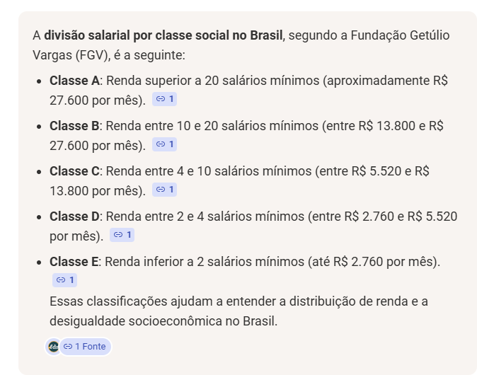
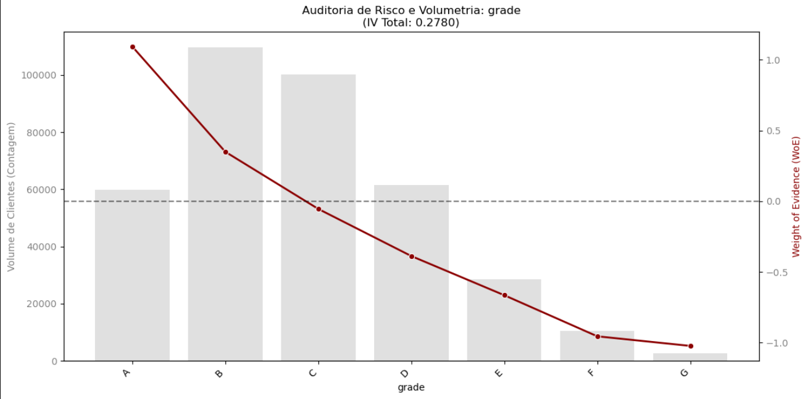

# 🏦 Credit Scorecard Engine: Do Laboratório (V1) à Esteira de Produção (V2)


> **"Modelos estatísticos de 'Caixa Preta' não sobrevivem a auditorias do Banco Central. Lucro real se protege com governança, higiene de dados e respeito à macroeconomia."**

Este repositório documenta a construção ponta a ponta de um **Scorecard de Crédito Multivariável** (*White-box Model*). O projeto ilustra a evolução de um modelo experimental (V1) para uma **Esteira de Governança de Risco (V2)**, detalhando o tratamento de dados brutos, a matemática do Weight of Evidence (WoE) e a simulação de impacto no balanço patrimonial sob estresse da Taxa Selic.

---

## 🎯 1. O Problema de Negócio (A Batalha de Modelos)

Modelos de risco puramente estatísticos quebram em produção por ingerirem "Lixo Operacional". Ao cruzar a base tratada com as predições na matriz de teste cega (*Out-of-Time*), comparamos o modelo *baseline* (V1) com a nossa esteira de alta governança (V2).

A introdução das réguas da FGV e o tratamento estrito de DTI no V2 eliminaram o *Overfitting* e recalibraram os pesos da Regressão Logística. 

**O Prêmio da Governança:** O V2 gerou um aumento de **R$ 33,69 milhões** adicionais na proteção de capital em relação ao V1.

| Métrica / Auditoria | V1 (Baseline / Caixa Cinza) | V2 (Champion / Auditável) | Impacto no Balanço |
| :--- | :--- | :--- | :--- |
| **GINI (Capacidade de Separação)** | 31.00% (AUC: 0.6550) | **32.93% (AUC: 0.6647)** | Maior precisão na distinção de risco. |
| **Caloteiros Reais Barrados** | 22.083 CPFs | **25.452 CPFs** | **+ 3.369** fraudes/calotes evitados. |
| **Estimativa de Loss Evitado** | R$ 220.830.000,00 | **R$ 254.520.000,00** | **+ R$ 33.690.000,00** salvos. |

---

## 🚀 2. Funcionalidades do Pipeline (A Anatomia dos Dados)

O sistema opera em uma arquitetura modularizada, separando a limpeza de dados da estatística e da tesouraria:

### A. Higiene de Dados & ETL
* **O Gabarito (Target):** Para evitar *Data Leakage*, a variável original `loan_status` foi ejetada após a criação da bússola binária `good_bad_loan` (1 = Lucro/Bom Pagador, 0 = Loss/Caloteiro).
* **Expurgo de Ativos Tóxicos (Regra dos 50%):** Variáveis com mais de 50% de dados nulos (NaN) foram sumariamente excluídas. Imputar esses vazios configuraria fraude estatística.
* **Filtro de Sobrevivência (Zero Data Loss):** Rendas anuais declaradas abaixo de R$ 3.600 não indicam pobreza, mas **erro de digitação na captação**. Em vez de deletar esses clientes (gerando *crash* na API em produção), o algoritmo recalibra essas distorções internamente.
* **Abrasileiramento (Padrão FGV):** A renda bruta não linearizada destrói a Regressão Logística. A base foi submetida ao enquadramento oficial da Fundação Getúlio Vargas (FGV), transformando valores contínuos em "gavetas" socioeconômicas auditáveis.

### B. Motor Estatístico (WoE & IV)
Para cumprir o Acordo de Basileia, algoritmos *Black-box* foram descartados. A matriz foi convertida em pesos de risco utilizando o **Weight of Evidence (WoE)**, que lineariza o risco calculando o logaritmo natural da proporção entre clientes adimplentes e inadimplentes:

$$WoE = \ln\left(\frac{\% Bons}{\% Maus}\right)$$

* **Auditoria de Monotonicidade:** Variáveis chave foram forçadas a apresentar progressão lógica. Ex: Hipotecas representam risco mitigado (WoE positivo), enquanto Locatários geram risco acentuado (WoE negativo).
* **Information Value (IV):** Variáveis com $IV < 0.02$ foram classificadas como "ruído inútil" e isoladas do motor preditivo.

### C. Laudo de Tesouraria: Teste de Estresse Macroeconômico (Copom)
Modelos estáticos falham quando o custo de captação do banco aumenta. O V2 possui uma **Política de Crédito Dinâmica** baseada no Valor Esperado (EV), reagindo em tempo real à Taxa Selic:

| Cenário Econômico | Selic (a.a.) | Taxa de Aprovação | CPFs Reprovados | Lucro Líquido Final |
| :--- | :--- | :--- | :--- | :--- |
| **Otimista (Dinheiro Barato)** | 7.0% | 91.0% | 8.414 | R$ 94.328.100,00 |
| **Base (Operação Normal)** | 10.5% | 84.7% | 14.300 | R$ 68.260.750,00 |
| **Estresse (Crise / Dinheiro Caro)** | 14.0% | 74.3% | 24.000 | R$ 45.317.600,00 |

> **Laudo do Auditor:** Observe como o modelo V2 blinda o Banco. Quando a Selic sobe para 14%, a margem de lucro cai. O algoritmo, percebendo que o Risco x Retorno não fecha, **DERRUBA a Taxa de Aprovação automaticamente (de 91% para 74.3%)**, barrando 24.000 CPFs na base de teste para defender o capital líquido do banco contra o Esmagamento de Margem.

### 🎙️ Sabatina Executiva: Margem, Selic e Garantias (Collateral)

**Pergunta do Comitê Comercial:** *"O seu relatório mostra que com a Selic a 14%, a nossa aprovação cai para 74%. Você está dizendo que o seu algoritmo destrói o faturamento da área comercial quando os juros sobem?"*

**Laudo do Auditor (A Solução de Negócio):**
O algoritmo não destrói o faturamento; ele impede a falência da carteira. A simulação expõe o fenômeno de **Esmagamento de Margem (Margin Squeeze)**. Com a nossa taxa travada nas premissas em 35%, captar dinheiro a 14% corrói o *spread*. O modelo age como um freio de emergência de liquidez: reduz a aprovação porque o lucro líquido remanescente já não cobre o custo estatístico da cauda de risco.

Para a Diretoria manter o *Market Share* (aprovação em 91%) no cenário de estresse sem gerar *Loss Operacional*, o algoritmo aponta duas saídas:
1. **Ajuste de Pricing:** Acionar a tesouraria para repassar a alta da Selic, elevando a taxa cobrada na ponta para reequilibrar o Valor Esperado.
2. **Exigência de Garantias Reais (Collateral):** Migrar os CPFs reprovados para linhas de crédito com garantia (Veículo ou Imóvel). Ao atrelar um bem físico à dívida, a severidade da perda (LGD) despenca, o Risco cai e o algoritmo volta a aprovar o crédito com segurança. A própria auditoria de WoE do modelo já valida isso: clientes com bens alienados (*Mortgage*) apresentam risco de *default* matematicamente mitigado. O modelo obedece à matemática; a estratégia define o produto.

### 🔎 2.D. FAQ de Auditoria: Defesa do Modelo (Comitê de Risco)

Esta seção documenta as decisões arquiteturais e de negócio, garantindo que o modelo suporte a sabatina de um comitê de crédito e atenda aos requisitos de auditoria interna.

**1. Risco de Negócio e C-Level (Diretoria Comercial)**
* **Pergunta do Comitê:** "Legal que o GINI subiu, mas como esse modelo vira dinheiro ou evita 'Loss' para o banco na vida real?"
* **Gabarito do Auditor Interno:** O modelo não é apenas um classificador, é um motor de *Pricing* dinâmico. O V2 gerou um aumento de R$ 33,69 milhões na proteção de capital barrando 3.369 caloteiros que o modelo antigo aprovaria. Além disso, ele reage ao custo de captação: se a Selic sobe para 14% e o spread achata, o modelo corta a aprovação para 74.3% automaticamente, protegendo o balanço contra safras tóxicas.

**2. Risco de Infraestrutura e Código (Engenharia e Governança)**
* **Pergunta do Comitê:** "Como você garante que não há 'Data Leakage' (vazamento de dados) ou dívida técnica que vai engasgar a esteira em produção?"
* **Gabarito do Auditor Interno:** A regra aqui é de tolerância zero para lixo operacional. A variável original `loan_status` foi ejetada imediatamente após a criação do *Target* binário para evitar *Data Leakage*. Variáveis com mais de 50% de nulos foram dropadas. Além disso, rendas absurdas não geram *crash* na API nem são deletadas (o que causaria perda de dados); elas são isoladas e penalizadas matematicamente pelo motor de WoE. O código é modular, auditável e não faz 'SELECT *' em base de produção.

**3. Risco Estatístico e Matemático (Modelagem Quantitativa)**
* **Pergunta do Comitê:** "Por que usar Regressão Logística com WoE em vez de um algoritmo mais robusto como Random Forest ou XGBoost para lidar com a base?"
* **Gabarito do Auditor Interno:** Modelos de 'Caixa Preta' não passam na auditoria do Banco Central (Bacen) para concessão de crédito, pois não explicam o motivo da recusa. Usamos o *Weight of Evidence* (WoE) porque ele lineariza a relação de risco e lida naturalmente com *missing values* e *outliers* sem precisar de imputações arbitrárias. O ganho de GINI (de 31.00% para 32.93%) prova que governança e higiene de dados (regras da FGV) batem algoritmos complexos operando em bases sujas.

**4. Fit Cultural e Background (Recursos Humanos / Gestor)**
* **Pergunta do Comitê:** "Você tem background em saúde e hotelaria. Por que deveríamos confiar a você a mesa de Risco de uma instituição financeira?"
* **Gabarito do Auditor Interno:** O Risco de Crédito exige a mesma frieza de uma UTI e o mesmo rigor de uma auditoria financeira noturna. Na UTI, um protocolo ignorado custa uma vida; no fechamento de caixa de um hotel, um cálculo displicente gera *loss* imediato. Trago essa mesma mentalidade para o código: sigo protocolos estritos, documento cada passo e não aprovo modelos 'mais ou menos'. A técnica eu codifico no Python; a governança e a gestão de crise sob pressão já estão consolidadas no meu perfil profissional.

---

## 📸 3. Evidências Visuais (O Dossiê de Auditoria)

### 1. Calibração de Renda (Padrão FGV)
*Para garantir alinhamento com a Diretoria Comercial, a base foi segmentada utilizando a documentação oficial da FGV (Salário Mínimo base R$ 1.380).*


### 2. Auditoria de Risco Visual (Monotonicidade WoE)
*A "escadinha" perfeita de risco: clientes com financiamento imobiliário (Mortgage) apresentam menor propensão ao default, enquanto locatários (Rent) geram WoE negativo.*


---

## 🛠️ 4. Arquitetura Técnica

O projeto segue princípios de **Clean Code** e **Governança de Dados**, isolando as etapas críticas de transformação para garantir reprodutibilidade.

```text
BASEL_RISK_MODELING/
├── data/                    # Data Lake (Bases de Crédito Bruta e Teste)
├── img/                     # Evidências Visuais e Documentação de Regras
├── src/                     # Motores de Processamento (Lógica Estrita)
│   ├── data_ingestion.py    # ETL e Higienização Inicial
│   ├── feature_engineering.py # Regras de Negócio (FGV e DTI)
│   ├── woe_iv.py            # Motor Estatístico (Weight of Evidence)
│   ├── scorecard_scaler.py  # P&L, Escalonamento e Estresse Selic
│   └── plots_woe.py         # Geração de Laudos Visuais
├── 01_Challenger_V1.ipynb   # Laboratório Experimental (Baseline)
├── 02_Champion_V2.ipynb     # Esteira de Produção e Teste Macroeconômico (Homologado)
├── README.md                # Documentação Executiva
└── requirements.txt         # Dependências do Projeto


# Clone o repositório
git clone [https://github.com/igorcarvah/lab_risco_quant.git](https://github.com/igorcarvah/lab_risco_quant.git)
